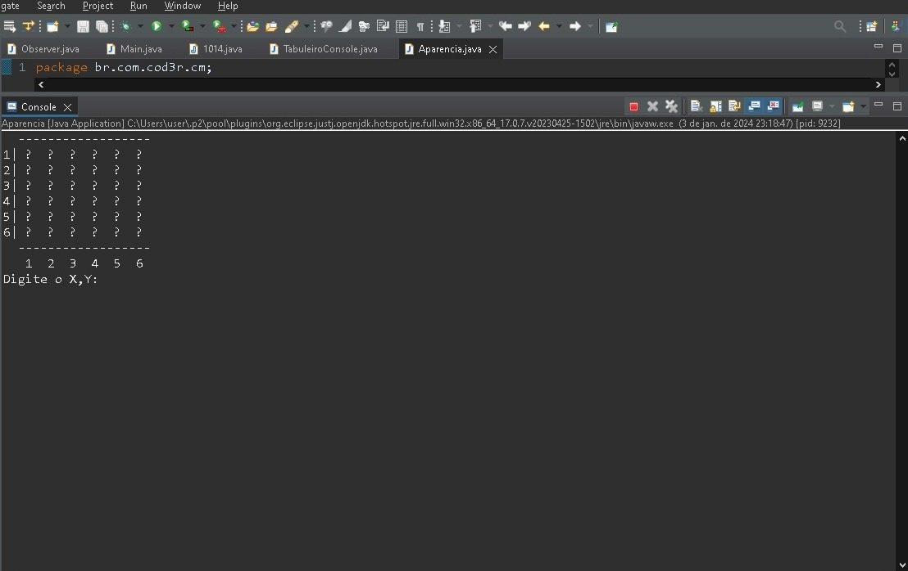
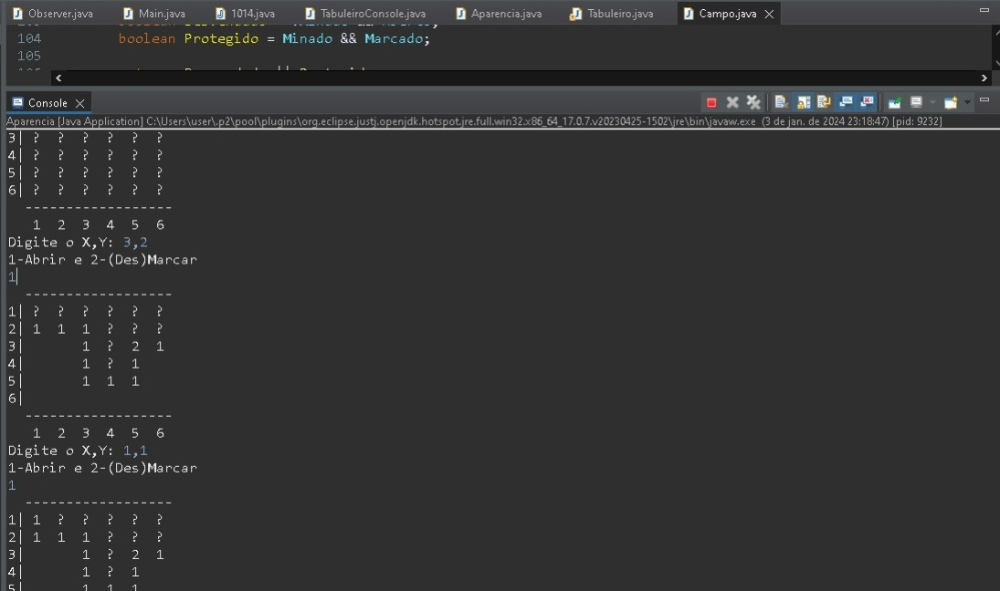
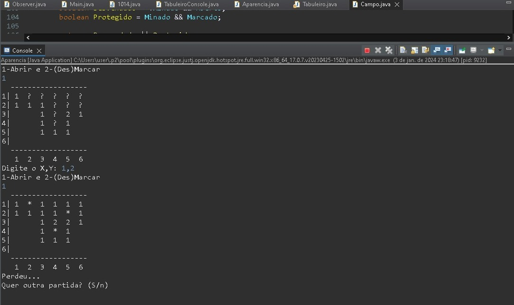
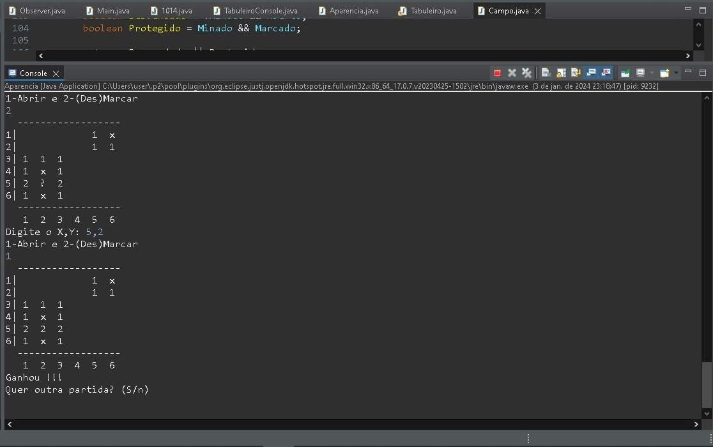

# Minesweeper in Java 👾

How you can play this game?

<<<<<<< HEAD
Below have the blog the How To Play Minesweeper for you understand about this game:

## <strong>PROJECT BASED IN THE [Java 2023](https://www.udemy.com/course/fundamentos-de-programacao-com-java/)</strong> 👽🤖

 <strong>In this game, I pratice OOP,Lambdas,API Stream and exception handling</u></strong>

Have one video this project in:

## PICTURES THIS PROJECT 🧠
        
### <strong><u> GAME START IN CONSOLE </u></strong>

### <strong><u>IN MID GAME</u></strong>

Translation:
type it the X,Y: (example: 3,2)
1-Open and 2- Mark(Off) -> To mark or Mark off

### <strong><u> HOW IS THE CONSOLE WHEN GAMEOVER? </u></strong>

Translation:
you lost...  Do you want another match? (Yes/no)

if user say nothing repeat the game

### <strong><u>HOW IS THE CONSOLE WHEN YOU WIN?</strong></u>

Translation:
YOU WIN...  Do you want another match? (Yes/no)
 
 

<strong> Thanks for your attention 👋
<strong>

    
<div\>
=======
Um jogo para prática de Programação Orientada a Objeto, Tratamento de Erros, Lambdas e API stream.
>>>>>>> a190ea72260680ae24081b247f2eb4de4cc82bf6
